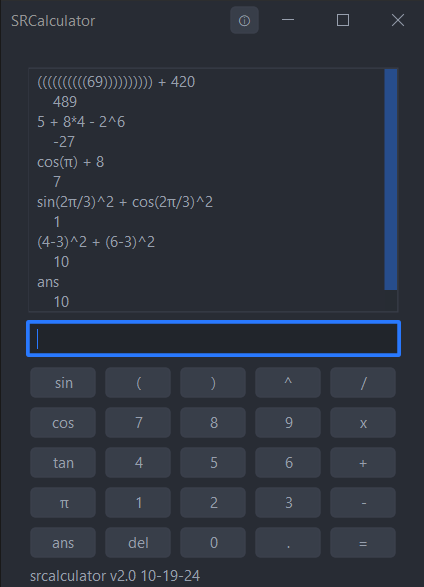

# 

# sr-java-scientific-calculator
# By: StephenKing638 (BoneDaddy638)
# Build: v2.0 10-19-24

# About
This simple scientific calculator app has a similar user interface as a Graphing calculator with a large display to see historical entries. The calculator automatically wraps expressions to respect the order of operations starting (in descending order) parenthesis, exponents and mod operations, multiplication and division, addition and subtraction.

Use a shortcut to the executable to pin to your taskbar, otherwise if you move the executable app from it's designated folder, the app will not run.

If the app decides that it does not want to run, ensure you have **JAVA 23** and your system variable `%JAVA_HOME%` refers to a proper java runtime path or you can also try to see if you can open up the jar file to see if java is configured.

I did not design the app icon; credit goes to [BlackDeathSS](https://github.com/BlackDeathSS).

# Key commands
* `esc` - exit
* `Ctrl + f3` - cycle color theme
* `Ctrl + f4` - clear entries
* `enter` - key shortcut to enter problem

# Syntax
* `()` - Parenthesis allow prioritization of operations by putting priority expressions in parenthesis. These should be balanced; otherwise, it will result in a syntax error.
* `^` - Exponentiation represents raising a number to a power.
* `*` - Multiplication.
* `/` - Division.
* `+` - Addition.
* `-` - Subtraction.
* `pi` - syntax for the pi constant
* `e` - syntax for the e constant
* `ans` - syntax for the previous answer

# Functions
* `frac(float)` - formats the expression as a fraction if necessary
* `sin(rad)` - sine function, defined as opposite / hypotenuse in a right-angled triangle
* `cos(rad)` - cosine function, defined as adjacent / hypotenuse in a right-angled triangle
* `tan(rad)` - tangent function, defined as opposite / adjacent in a right-angled triangle
* `asin(rad)` - inverse sine function, returns the angle whose sine is the given number
* `acos(rad)` - inverse cosine function, returns the angle whose cosine is the given number
* `atan(rad)` - inverse tangent function, returns the angle whose tangent is the given number
* `sinh(rad)` - hyperbolic sine function, defined as `(e^x - e^(-x)) / 2`
* `cosh(rad)` - hyperbolic cosine function, defined as `(e^x + e^(-x)) / 2`
* `tanh(rad)` - hyperbolic tangent function, defined as `(sinh(x) / cosh(x))`
* `abs(float)` - returns the absolute value of a number
* `log(float)` - natural logarithm (logarithm to the base e) of a number
* `ceil(float)` - returns the smallest integer greater than or equal to the given number
* `floor(float)` - returns the largest integer less than or equal to the given number
* `sqrt(float)` - returns the square root of a number
* `cbrt(float)` - returns the cube root of a number
* `pow(base, power)` - returns the value of a number raised to the power of another number (base^power)
* `exp(power)` - returns the value of e (Euler's number) raised to the power of the given number
* `signum(float)` - returns the sign of a number: `1` if positive, `-1` if negative, and `0` if zero

# Examples
1. **Basic Arithmetic:**
   - Addition: `5 + 3` result: `8`
   - Subtraction: `10 - 7` result: `3`
   - Multiplication: `4 * 6` result: `24`
   - Division: `20 / 5` result: `4`

2. **Advanced Operations:**
   - Exponents: `2^3` result: `8.0` (equivalent to 2 raised to the power of 3)
   - Square roots: `9^(1/2)` result: `3.0`, This calculator does not directly support square roots, but raising an expression to the power of 1 / x calculates the x root of that base.

3. **Complex Expressions:**
   - `(3 + 5) * (2^2 - 1)` result: `24` - Utilizing parenthesis and exponentiation for complex calculations.

4. **Special Cases:**
   - `NaN` occurs when dividing an expression by 0: `1/0`, even rooting a negative: `-9 ^ (1/2)`, or if the expression results in an expression to large/small to be represented within a double: `1.797 E308`

5. **Common Syntax Errors:**
   - Unbalanced Parenthesis: `3 * (2 + 4 - 1`
   - Misplaced Operators: `2 ^ * 3`

# Changelog

## v2.0 10-18-24
* Rebuild using net.objecthunter exp4j library
* Rebuild gui
* Save settings
* Several themes to choose from

## v1.1 1-23-2024
* Window is now always on top of any other window to make it more convenient.

## v1.1 1-17-2024
* Added number pad
* Handling for special arithmetic cases
* Minor bug fixes with wrapping and operation insertion
* Added pi and e constant

## v1.0 1-16-2024
* Calculator UI with area to enter expressions and an enter button to commit a field
* Math logic for all PEMDAS operations and mod operations
    - reads String expressions and operates on them
    - recognizes syntax errors
    - automatically wraps expressions in parenthesis